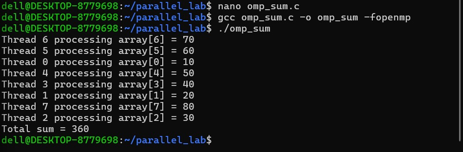
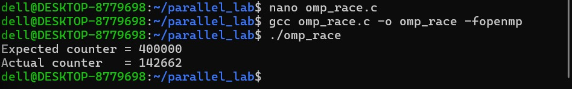
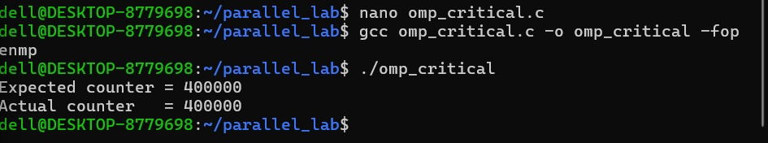
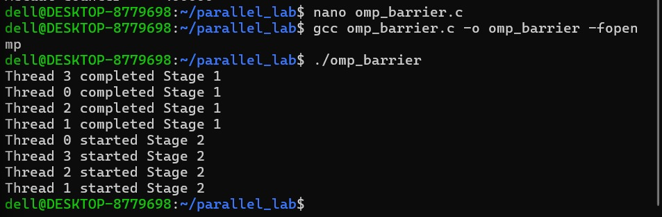
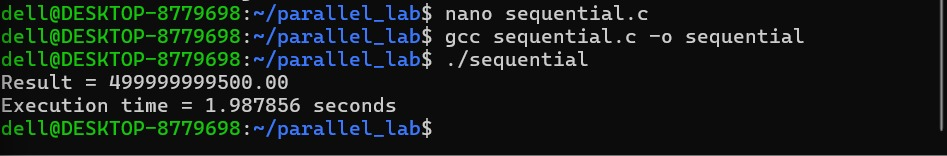
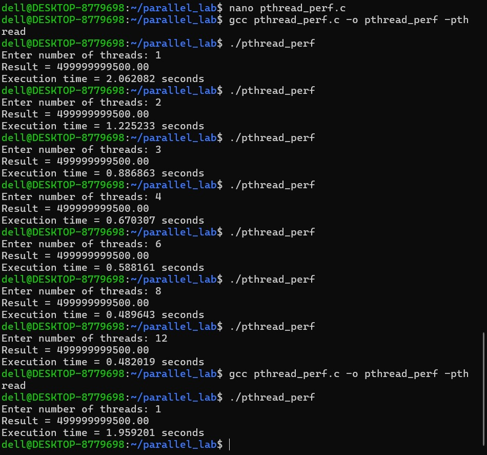
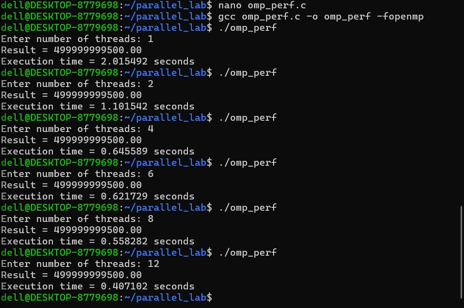

## 7. Screenshots

### Pthreads

**01_thread1.png – Pthreads Single Thread Execution**

**02_thread2.png – Pthreads Multiple Threads**

**03_thread_sum.png – Pthreads Work Distribution**

**04_race_condition.png – Pthreads Race Condition**

**05_mutex.png – Pthreads Mutex Synchronization**

### OpenMP

**06_openmp_parallel.png – OpenMP Parallel Region**

**07_openmp_work_sharing.png – OpenMP Work Sharing and Reduction**

**08_openmp_race_condition.png – OpenMP Race Condition**

**09_openmp_critical.png – OpenMP Critical Section**

**10_openmp_barrier.png – OpenMP Barrier Synchronization**

### Performance

**11_sequential_baseline.png – Sequential Performance Baseline**

**12_pthread_performance.png – Pthreads Performance**

**13_openmp_performance.png – OpenMP Performance**

