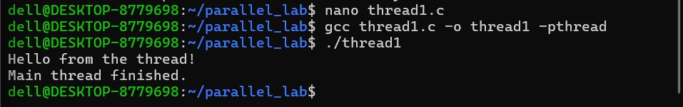
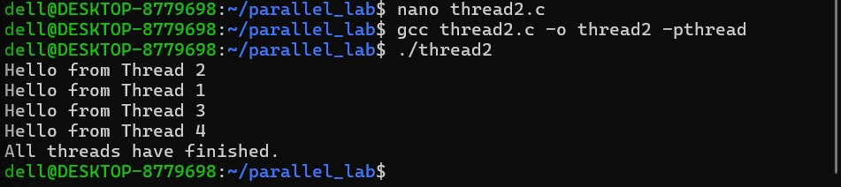
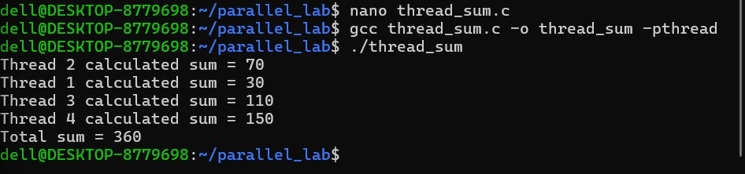
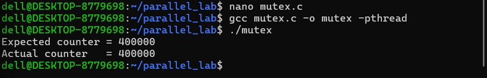
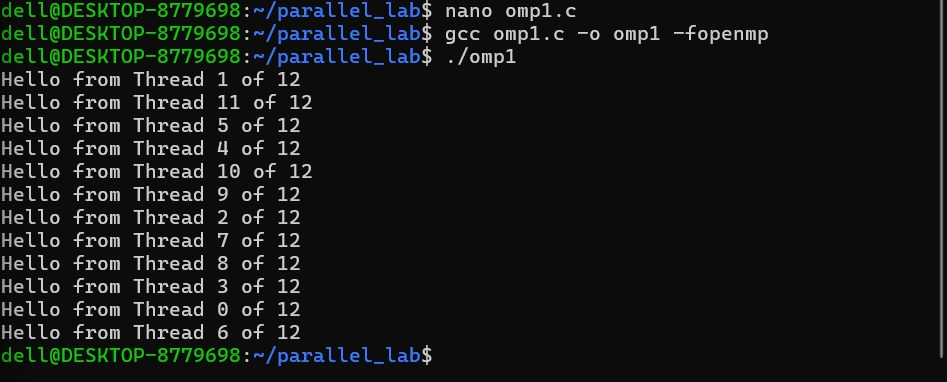

## Screenshots

### Pthreads

**01_pthread_one_thread.png**

**02_pthread_multiple_threads.png**

**03_pthread_work_distribution.png**

**04_pthread_race_condition.png**

**05_pthread_mutex.png**

### OpenMP

**06_openmp_parallel_region.png**

**07_openmp_work_sharing.png**

**08_openmp_race_condition.png**

**09_openmp_critical.png**

**10_openmp_barrier.png**

### Performance

**11_sequential_baseline.png**

**12_pthread_performance.png**

**13_openmp_performance.png**

